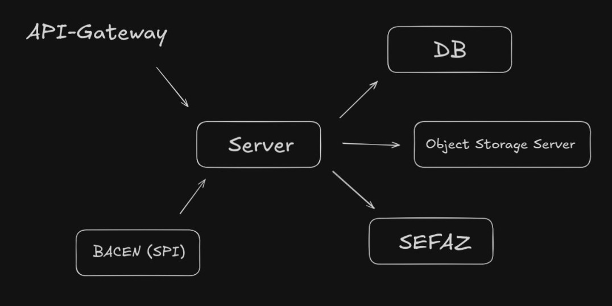

# Woovi Challenge: NFe

This project is a solution to the Woovi challenge of creating a system that integrates with the NF-e (Nota Fiscal Eletrônica) system. The main idea is to streamline operations by automatically issuing an NFC-e (Nota Fiscal do Consumidor Eletrônica) the moment a Pix payment is completed.
Check [Code challenge](https://github.com/woovibr/jobs).

## Architecture

The project is a monorepo composed of two applications:

*   **`server`**: The main application that exposes a REST API for creating and retrieving NF-e and Pix transactions.
*   **`sefaz-mock`**: A mock of the SEFAZ (Secretaria da Fazenda) services that the `server` application communicates with.

## How to run

To run the project, you will need to have `docker-compose` installed. Then, simply run the following command:

```sh
docker-compose up
```

This will start all the services, including the `server`, `sefaz-mock`, `minio`, and `mongodb`.

## API Endpoints

- POST routes
    - /company: Used to register or create a new company in the system.
    - /certificate/:id: Responsible for processing certificate information, likely associated with a specific ID.
    - /product: Allows the creation or registration of a new product.
    - /sale: Used to register a new sale or transaction.
    - /webhook: This endpoint is configured to receive notifications (fake Bacen communication) related to Pix events, such as payment confirmations.
- GET route
    - /health: A simple endpoint to check the service's health. Returns the message "It's ok here!" indicating that the application is operational.

Check [Postman collection](https://www.postman.com/tiagogottardo-7997945/workspace/tiago-public-workspace/request/46863462-281049d2-6859-4321-95a9-3ad3b15a15ff?action=share&creator=46863462&ctx=documentation). Check it with server logs to see communicattion with sefaz.

## How it was done

### Fluxogram



### Main Scenario

1. User creates a Pix request using the /sale endpoint.
2. The server responds with a QR code.
3. The user's customer makes the Pix payment.
4. Bacen (SPI) settles the payment and notifies the Server (The real communication with SPI does not use a webhook. I'll explain later).
5. The server retrieves the A1 certificate and key to sign the NFC-e.
6. The server prepares the NFC-e XML and sends the request to Sefaz via SOAP protocol synchronously.
7. Sefaz authorizes the NFC-e.


### Technologies

*   **`server`**:
    *   [Koa](https://koajs.com/): A modern and expressive Node.js web framework.
    *   [Mongoose](https://mongoosejs.com/): An elegant MongoDB object modeling for Node.js.
    *   [Minio](https://min.io/): A high-performance, S3 compatible object storage.
    *   [soap](https://github.com/vpulim/node-soap): A SOAP client and server for Node.js.
    *   [xml-crypto](https://github.com/yaronn/xml-crypto): A library for signing XML documents.
*   **`sefaz-mock`**:
    *   [Koa](https://koajs.com/): A modern and expressive Node.js web framework.
    *   [soap](https://github.com/vpulim/node-soap): A SOAP client and server for Node.js.

## Additions to real application

- Send DANFE by email to tranporter
- Support more complex tax regimes (Lucro presumido, Lucro real, ...)
- Support in contingency NFe emission
- Use real communication with SPI. (Server search for new message on SPI, pooling. Check [Pix Standard Manual](https://www.bcb.gov.br/content/estabilidadefinanceira/pix/Regulamento_Pix/II_ManualdePadroesparaIniciacaodoPix.pdf) to see details.)
- Use async requests and queues to deal with scalability 
